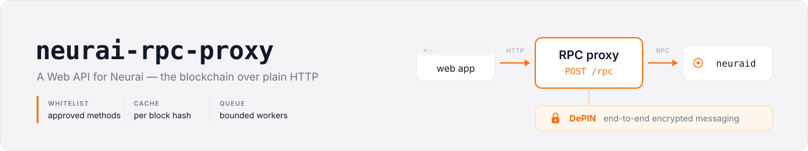

# neurai-rpc-proxy

## A Web API for Neurai

**Purpose**: make Neurai blockchain available via HTTP/WEB by exposing the RPC-API via a Proxy that only allows an explicitly approved set of methods.

Check out this software live at:

**MAIN**: https://rpc-main.neurai.org

**TESTNET**: https://rpc-testnet.neurai.org

## Features

- **Standard RPC Proxy** (`/rpc`) - Expose standard Neurai RPC calls with caching
- **DePIN Testnet support** - The proxy reaches the whitelisted `depin*` methods through the standard node RPC. DePIN protocol 2 authenticates holders with signed challenges and answers encrypted, pool-key-signed replies, so the proxy never needs to be trusted with anything
- **Smart Caching** - Cache responses based on block height to reduce node load
- **Queue Management** - Control concurrent requests to your Neurai node
- **Whitelist Protection** - Only allow an explicitly approved set of methods. Mostly reads, plus a few writes that carry their own proof (`sendrawtransaction`, `depinsubmitmsg`, `depinclearmsg`); anything needing the node's wallet or private keys stays out
- **Multi-Node Support** - Automatic failover between multiple Neurai nodes

## DePIN

The proxy only connects to the node's standard HTTP RPC endpoint; the whitelisted
`depin*` methods go through `/rpc` like any other method. There is no DePIN-specific
URL or port.

**Sections are sub-assets.** The node serves one pool root (`&NEWS`); its sub-assets
are sections (`&NEWS/GENERAL`, `&NEWS/GENERAL/SPORT`). Access is inherited downward,
never upward: a holder of `&NEWS` reads everything, a holder of `&NEWS/GENERAL` reads
that branch only. Holdings are soulbound, on-chain data, so any client can verify who
takes part with `listdepinholders`, `checkdepinvalidity` and `getpubkey`. The proxy's
web page walks through the sequence (discover → authenticate → read → publish) as
`fetch` examples against the configured endpoint.

The Docker deployments intentionally differ: mainnet pulls the official
`neuraiproject/neurai-node:v1.0.6` image, which has no DePIN messaging implementation,
while testnet builds the `DePIN-Test` branch and enables it. That branch serves DePIN **protocol 2** on the node's RPC port
only; there is no separate gateway port any more.

Protocol 2 in one paragraph: a holder signs a timestamped request with its own key
and asks `depinchallenge` for a single-use nonce (the request is accepted once and
only near the node's clock; the reply is encrypted for the holder's on-chain public
key), signs the nonce, and passes nonce + signature to `depinreceivemsg`,
`depinlistsections` or `depinclearmsg`. Every authenticated reply carries the next nonce inside its
encrypted body, so a client that keeps reading calls `depinchallenge` once. Every
reply carries `poolsig`, the node's pool-key signature; the client pins
`depingetmsginfo.depinpoolpkey` on first use and verifies `poolsig` locally from then
on — never by asking this proxy, which is exactly the party the scheme is designed
not to trust. Publishing goes through `depinsubmitmsg` with the serialized message
wrapped in an ECIES envelope for the pool key. Message content is encrypted per
recipient and never readable by the node or the proxy. See `doc/depinreceivemsg.md`
in the node repository for the full contract.

The testnet node therefore runs **with a wallet** (`NEURAI_DISABLE_WALLET=0`): the pool
key is derived from a dedicated, unencrypted, legacy BIP44 wallet that must never hold
funds. No other bootstrap is needed: the node refuses to start the service without
such a wallet, and the entrypoint refuses earlier, with the reason.

Abuse control is split: the node limits challenges issued and messages accepted per
**address** and minute (`depinratelimit`, `NEURAI_DEPIN_RATE_LIMIT`), counting only
requests signed by that address — a forged request is refused before it touches
anyone's quota — and this proxy
limits `depin*` requests per **origin IP** and minute (`depin_rate_limit`, default 60)
and blocks the IP for `depin_ban_minutes` (default 60) when it goes over, answering
`429` with `Retry-After`. The node cannot see origin IPs behind the proxy, which is
why the split exists. Set `trust_proxy` only when a trusted reverse proxy in front
sets `X-Forwarded-For`; otherwise clients could choose their own identity.

**Upgrading from 1.1.x:** `depingetpoolcontent` is gone (the node no longer has it;
pool-wide metadata has no identity to bind a challenge to), and `depinreceivemsg`,
`depinlistsections` and `depinclearmsg` now require the challenge/signature pair
described above. The per-node `depin_enabled` / `depin_url` keys in `config.json` are
obsolete: the proxy logs a notice and ignores them.


## How do I use this software?

When your local proxy is up and running you send requests using HTTP Post.
The body of the request should contain string **method** and array **params** 

### Example for web browser and Node.js 18+
```
//Get block count
rpc("getblockcount", []).then(function (count) {
    console.log("Block count", count);
});

//Get transactions in mempool
rpc("getrawmempool", []).then(function (data) {
    console.log("There are", data.length, "transactions in mempool right now");
});

//Get specific transaction
rpc("getrawtransaction", ["301ec56896153463576c47ac40956e58d2b9fa7de87fad39128c5ae0af66b6a4", true]).then(transaction => {
    console.log("Transaction", transaction.hash, "has", transaction.confirmations, "confirmations");
})

//Get address balance
rpc("getaddressbalance", [{ "addresses": ["RXissueSubAssetXXXXXXXXXXXXXWcwhwL"] }]).then(balance => {
    const sum = balance.balance / 1e8;//divide by 100 000 000;
    console.log("RXissueSubAssetXXXXXXXXXXXXXWcwhwL balance", sum.toLocaleString());
})


async function rpc(method, params) {
    const data = { method, params };
    const URL = 'https://xna-main.neurai.org/rpc'; //replace with your endpoint
    const response = await fetch(URL, {
        method: 'POST',
        headers: {
            'Content-Type': 'application/json'
        },
        body: JSON.stringify(data) // body data type must match "Content-Type" header
    });
    const obj = await response.json(); // parses JSON response into native JavaScript objects 
    return obj.result;
} 
``` 
## Features and limitations

This software lives up to parts of the JSON-RPC 2.0 Specification
https://www.jsonrpc.org/specification

According to JSON-RPC 2.0 a request object could contain four attributes, jsonrpc, method, params and id.
- This software only supports **method** and **params**.
- This software does NOT support **id**
- This software hardcodes **jsonrpc** to "2.0"
- This sofware does NOT support batch calls.

## How to install
```
git clone https://github.com/neuraiproject/neurai-rpc-proxy.git
cd neurai-rpc-proxy
npm install 
```

### Docker

Two stacks, one per network, each with its own `.env`:

```
cd docker/mainnet        # or docker/testnet
cp .env.example .env     # ports and RPC credentials shared by node and proxy
docker compose up -d
```

`.env` is ignored by git, so your values survive a `git pull`; `.env.example` is the
template that changes when a new variable appears. Every variable has the same
default in the compose file, so a stack also starts without a `.env`.

- **mainnet** pulls `neuraiproject/neurai-node:v1.0.6` from Docker Hub. The image
  writes `/data/neurai.conf` from its `NEURAI_*` variables **on the first start only**
  and keeps it in the volume, so changing a value in `.env` later does not reach a
  node that already has its file. To apply one, delete the file and restart; the
  entrypoint regenerates it: `docker compose exec neuraid rm /data/neurai.conf &&
  docker compose restart neuraid`. The proxy, by contrast, re-reads `.env` on every
  `up -d`, so keep both in step. The node runs as the unprivileged user `neurai`
  (uid 999); the RPC and ZMQ ports stay inside the compose network.
- **testnet** builds the `DePIN-Test` branch with `docker/node/Dockerfile` and the
  env-driven `entrypoint.sh` next to it; see the DePIN section above.

**Upgrading a mainnet node from the v1.0.5 image:** its data directory was
`/data/node`; v1.0.6 uses `/data` and the volume keeps the old layout, so without a
move the new node would resync from scratch. Once, with the stack stopped:

```
docker compose down
docker run --rm -v neurai-wallet-rpc-mainnet_neurai_data_mainnet:/data alpine sh -c \
  'cd /data && for f in node/* node/.[!.]*; do [ -e "$f" ] && mv "$f" .; done; \
   rmdir node; rm -f neurai.conf .lock; chown -R 999:999 /data'
docker compose up -d
```

The old `neurai.conf` is dropped on purpose (it was a read-only bind mount, only an
empty mount point may be left behind) so the image generates the new one from `.env`.

### How do I configure this software?
Configure your setup in ./config.json

**Standard configuration:**
```json
{
    "concurrency": 4,
    "endpoint": "https://rpc-main.neurai.org/rpc",
    "environment": "Neurai",
    "local_port": 19999,
    "nodes": [
      {
        "name": "Node number 1",
        "username": "dauser",
        "password": "dapassword",
        "neurai_url": "http://localhost:19001"
      }
    ]
}
```

**Configuration Options:**
- `concurrency` - Number of concurrent requests to handle
- `endpoint` - Public endpoint URL (displayed in UI)
- `environment` - Environment name (displayed in UI)
- `local_port` - Port for the proxy server
- `nodes` - Array of Neurai nodes for failover
  (`depin_enabled` / `depin_url` from 1.1.x are obsolete and ignored — DePIN goes through `neurai_url`)
- `depin_rate_limit` - `depin*` requests allowed per origin IP and minute (default 60, 0 disables)
- `depin_ban_minutes` - How long an IP that exceeded the limit is blocked (default 60)
- `trust_proxy` - Express `trust proxy` setting; enable only behind a trusted reverse proxy that sets `X-Forwarded-For`

### How should my Neurai node be configured?

**For standard RPC:**
```
server=1 
listen=1

# Full transaction index
txindex=1

# Address index (needed for getaddress* calls)
addressindex=1

# Asset index (needed for getassetdata)
assetindex=1

# Timestamp index
timestampindex=1

# Maintains the full Spent index on your node. Default is 0.
spentindex=1

# Username and password - set secure username/password
rpcuser=secret
rpcpassword=secret

# What IP address is allowed to make calls to the RPC server.
rpcallowip=127.0.0.1

dbcache=4096
```

For the testnet `DePIN-Test` branch, set `depinmsg=1` and `depinmsgtoken`, keep the
wallet enabled, and optionally tune `depinratelimit` (the compose file does this
through environment variables). There is no DePIN port: the service is served on the RPC port
the proxy already talks to. The stable `v1.0.6` mainnet node does not accept these
options.

## Sir, how do I start this application?

```
npm start
```

## Help with Neurai RPC calls, arguments and stuff
Go to https://xna-main.neurai.org/ for in depth description of each RPC call


## List of Neurai RPC calls
This is a raw list, a lot of these calls are not whitelisted.
For example we do NOT let developers call procedure `dumpprivkey`
```
== Addressindex ==
getaddressbalance
getaddressdeltas
getaddressmempool
getaddresstxids
getaddressutxos

== Assets ==
getassetdata "asset_name"
getcacheinfo 
getsnapshot "asset_name" block_height
issue "asset_name" qty "( to_address )" "( change_address )" ( units ) ( reissuable ) ( has_ipfs ) "( ipfs_hash )"
issueunique "root_name" [asset_tags] ( [ipfs_hashes] ) "( to_address )" "( change_address )"
listaddressesbyasset "asset_name" (onlytotal) (count) (start)
listassetbalancesbyaddress "address" (onlytotal) (count) (start)
listassets "( asset )" ( verbose ) ( count ) ( start )
listmyassets "( asset )" ( verbose ) ( count ) ( start ) (confs) 
purgesnapshot "asset_name" block_height
reissue "asset_name" qty "to_address" "change_address" ( reissuable ) ( new_units) "( new_ipfs )" 
transfer "asset_name" qty "to_address" "message" expire_time "change_address" "asset_change_address"
transferfromaddress "asset_name" "from_address" qty "to_address" "message" expire_time "rvn_change_address" "asset_change_address"
transferfromaddresses "asset_name" ["from_addresses"] qty "to_address" "message" expire_time "rvn_change_address" "asset_change_address"

== Blockchain ==
clearmempool
decodeblock "blockhex"
getbestblockhash
getblock "blockhash" ( verbosity ) 
getblockchaininfo
getblockcount

getblockhash height
getblockhashes timestamp
getblockheader "hash" ( verbose )
getchaintips
getchaintxstats ( nblocks blockhash )
getdifficulty
getmempoolancestors txid (verbose)
getmempooldescendants txid (verbose)
getmempoolentry txid
getmempoolinfo
getrawmempool ( verbose )
getspentinfo
gettxout "txid" n ( include_mempool )
gettxoutproof ["txid",...] ( blockhash )
gettxoutsetinfo
preciousblock "blockhash"
pruneblockchain
savemempool
verifychain ( checklevel nblocks )
verifytxoutproof "proof"

== Control ==
getinfo
getmemoryinfo ("mode")
getrpcinfo
help ( "command" )
stop
uptime

== Generating ==
generate nblocks ( maxtries )
generatetoaddress nblocks address (maxtries)
getgenerate
setgenerate generate ( genproclimit )

== Messages ==
clearmessages 
sendmessage "channel_name" "ipfs_hash" (expire_time)
subscribetochannel 
unsubscribefromchannel 
viewallmessagechannels 
viewallmessages 

== Mining ==
getblocktemplate ( TemplateRequest )
getkawpowhash "header_hash" "mix_hash" nonce, height, "target"
getmininginfo
getnetworkhashps ( nblocks height )
pprpcsb "header_hash" "mix_hash" "nonce"
prioritisetransaction <txid> <dummy value> <fee delta>
submitblock "hexdata"  ( "dummy" )

== Network ==
addnode "node" "add|remove|onetry"
clearbanned
disconnectnode "[address]" [nodeid]
getaddednodeinfo ( "node" )
getconnectioncount
getnettotals
getnetworkinfo
getpeerinfo
listbanned
ping
setban "subnet" "add|remove" (bantime) (absolute)
setnetworkactive true|false

== Rawtransactions ==
combinerawtransaction ["hexstring",...]
createrawtransaction [{"txid":"id","vout":n},...] {"address":(amount or object),"data":"hex",...}
decoderawtransaction "hexstring"
decodescript "hexstring"
fundrawtransaction "hexstring" ( options )
getrawtransaction "txid" ( verbose )
sendrawtransaction "hexstring" ( allowhighfees )
signrawtransaction "hexstring" ( [{"txid":"id","vout":n,"scriptPubKey":"hex","redeemScript":"hex"},...] ["privatekey1",...] sighashtype )
testmempoolaccept ["rawtxs"] ( allowhighfees )

== Restricted assets ==
addtagtoaddress tag_name to_address (change_address) (asset_data)
checkaddressrestriction address restricted_name
checkaddresstag address tag_name
checkglobalrestriction restricted_name
freezeaddress asset_name address (change_address) (asset_data)
freezerestrictedasset asset_name (change_address) (asset_data)
getverifierstring restricted_name
issuequalifierasset "asset_name" qty "( to_address )" "( change_address )" ( has_ipfs ) "( ipfs_hash )"
issuerestrictedasset "asset_name" qty "verifier" "to_address" "( change_address )" (units) ( reissuable ) ( has_ipfs ) "( ipfs_hash )"
isvalidverifierstring verifier_string
listaddressesfortag tag_name
listaddressrestrictions address
listglobalrestrictions
listtagsforaddress address
reissuerestrictedasset "asset_name" qty to_address ( change_verifier ) ( "new_verifier" ) "( change_address )" ( new_units ) ( reissuable ) "( new_ipfs )"
removetagfromaddress tag_name to_address (change_address) (asset_data)
transferqualifier "qualifier_name" qty "to_address" ("change_address") ("message") (expire_time) 
unfreezeaddress asset_name address (change_address) (asset_data)
unfreezerestrictedasset asset_name (change_address) (asset_data)

== Restricted ==
viewmyrestrictedaddresses 
viewmytaggedaddresses 

== Rewards ==
cancelsnapshotrequest "asset_name" block_height
distributereward "asset_name" snapshot_height "distribution_asset_name" gross_distribution_amount ( "exception_addresses" ) ("change_address") ("dry_run")
getdistributestatus "asset_name" snapshot_height "distribution_asset_name" gross_distribution_amount ( "exception_addresses" )
getsnapshotrequest "asset_name" block_height
listsnapshotrequests ["asset_name" [block_height]]
requestsnapshot "asset_name" block_height

== Util ==
createmultisig nrequired ["key",...]
estimatefee nblocks
estimatesmartfee conf_target ("estimate_mode")
signmessagewithprivkey "privkey" "message"
validateaddress "address"
verifymessage "address" "signature" "message"

== Depin asset ==
checkdepinvalidity
depingetancestorrecipients
freezedepin
getpubkey
listdepinaddresses
listdepinholders
selfrevokedepin
unfreezedepin

== Depin messaging (protocol 2, DePIN-Test branch only) ==
depinchallenge
depinclearmsg
depingetmsg
depingetmsginfo
depinlistsections
depinmcpstatus
depinpoolpkey
depinpoolstats
depinreceivemsg
depinsendmsg
depinsignchallenge
depinsignrequest
depindecrypt
depinsubmitmsg

== Wallet ==
abandontransaction "txid"
abortrescan
addmultisigaddress nrequired ["key",...] ( "account" )
addwitnessaddress "address"
backupwallet "destination"
bumpfee has been deprecated on the RVN Wallet.
dumpprivkey "address"
dumpwallet "filename"
encryptwallet "passphrase"
getaccount "address"
getaccountaddress "account"
getaddressesbyaccount "account"
getbalance ( "account" minconf include_watchonly )
getmasterkeyinfo
getmywords ( "account" )
getnewaddress ( "account" )
getrawchangeaddress
getreceivedbyaccount "account" ( minconf )
getreceivedbyaddress "address" ( minconf )
gettransaction "txid" ( include_watchonly )
getunconfirmedbalance
getwalletinfo
importaddress "address" ( "label" rescan p2sh )
importmulti "requests" ( "options" )
importprivkey "privkey" ( "label" ) ( rescan )
importprunedfunds
importpubkey "pubkey" ( "label" rescan )
importwallet "filename"
keypoolrefill ( newsize )
listaccounts ( minconf include_watchonly)
listaddressgroupings
listlockunspent
listreceivedbyaccount ( minconf include_empty include_watchonly)
listreceivedbyaddress ( minconf include_empty include_watchonly)
listsinceblock ( "blockhash" target_confirmations include_watchonly include_removed )
listtransactions ( "account" count skip include_watchonly)
listunspent ( minconf maxconf  ["addresses",...] [include_unsafe] [query_options])
listwallets
lockunspent unlock ([{"txid":"txid","vout":n},...])
move "fromaccount" "toaccount" amount ( minconf "comment" )
removeprunedfunds "txid"
rescanblockchain ("start_height") ("stop_height")
sendfrom "fromaccount" "toaddress" amount ( minconf "comment" "comment_to" )
sendfromaddress "from_address" "to_address" amount ( "comment" "comment_to" subtractfeefromamount replaceable conf_target "estimate_mode")
sendmany "fromaccount" {"address":amount,...} ( minconf "comment" ["address",...] replaceable conf_target "estimate_mode")
sendtoaddress "address" amount ( "comment" "comment_to" subtractfeefromamount replaceable conf_target "estimate_mode")
setaccount "address" "account"
settxfee amount
signmessage "address" "message"

```
